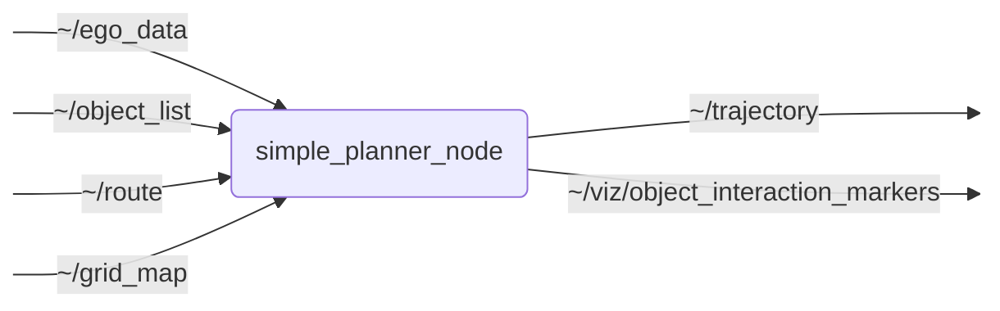

# `simple_planner`

Generates route-following reference trajectories with safe-stop, traffic-light, occupancy-grid, turn-signal, and object-aware speed handling.

## Nodes

### `simple_planner_node`

#### Subscribed Topics

| Topic | Type | Description |
| --- | --- | --- |
| `~/ego_data` | `perception_msgs/msg/EgoData` | Current ego state used for planning, timeout checks, and safe-stop fallback |
| `~/object_list` | `perception_msgs/msg/ObjectList` | Perceived objects with predictions used for object-aware speed reduction |
| `~/route` | `route_planning_msgs/msg/Route` | Route with lane, speed-limit, lane-change, and regulatory information |
| `~/grid_map` | `nav_msgs/msg/OccupancyGrid` | Occupancy grid used to stop before blocked cells when grid-map handling is enabled |

#### Published Topics

| Topic | Type | Description |
| --- | --- | --- |
| `~/trajectory` | `trajectory_planning_msgs/msg/Trajectory` | Planned reference trajectory for the ego vehicle |
| `~/viz/object_interaction_markers` | `visualization_msgs/msg/MarkerArray` | RViz markers for object-conflict positions during the speed-reduction loop |

#### Parameters

| Parameter | Type | Default | Description |
| --- | --- | --- | --- |
| `trajectory_frame_id` | `string` | `"base_link"` | Frame ID of published reference trajectory |
| `fixed_over_time_frame_id` | `string` | `"map"` | Frame ID of frame that is fixed over time for finding temporal transforms |
| `frequency` | `float` | `10.0` | Frequency of reference planning cycle (Hz) |
| `route_timeout` | `float` | `1.0` | Time after which a received route is considered invalid (s) (use -1 for no timeout) |
| `ego_data_timeout` | `float` | `1.0` | Time after which a received ego vehicle data is considered invalid (s) (use -1 for no timeout) |
| `object_timeout` | `float` | `1.0` | Time after which a received object list is considered invalid (s) (use -1 for no timeout) |
| `trajectory_horizon` | `float` | `10.0` | Time horizon of the reference trajectory (s) |
| `n_states` | `int` | `51` | Number of states in the output trajectory |
| `interpolation_type` | `int` | `1` | 0: linear, 1: cubic spline |
| `v_ref` | `float` | `13.89` | Reference velocity (m/s); set for all states in the trajectory. Set to '-1.0' to use velocity from route. |
| `a_decel` | `float` | `-0.5` | Desired deceleration for braking at stop lines or end of route (m/s^2) - must be < 0.0 |
| `a_max_decel` | `float` | `-1.0` | Maximum deceleration for safe-stop trajectories (m/s^2) - must be < 0.0 and <= a_decel |
| `trigger_turn_signals` | `bool` | `true` | True: planner will trigger turn signal services; false: planner will not request turn signals |
| `consider_traffic_lights` | `bool` | `true` | True: planner will consider traffic lights; false: planner will ignore traffic lights |
| `offset_to_stop_line` | `float` | `0.0` | Additional distance to stop in front of a stop line (m) (default: 0.0 -> stops with front of vehicle at stop line) |
| `ignore_stop_line_threshold` | `float` | `0.5` | A stop line will be ignored if the front of the vehicle has already passed the stop line by more than this threshold (m) |
| `consider_future_states` | `bool` | `false` | True: trajectory will consider forecast of traffic light states; false: trajectory will only consider current traffic light state |
| `consider_objects` | `bool` | `true` | True: planner will consider perceived objects on the route; false: planner will ignore objects |
| `min_prediction_prob` | `float` | `0.0` | Minimum probability for considering an object prediction branch |
| `object_longitudinal_safety_distance` | `float` | `1.5` | Longitudinal clearance around ego/object bounding boxes for conflict detection (m) |
| `object_lateral_safety_distance` | `float` | `0.0` | Lateral clearance around ego/object bounding boxes for conflict detection (m) |
| `object_interaction_time_window` | `float` | `0.5` | Maximum time offset for counting a spatial overlap as interaction (s) |
| `object_velocity_reduction_step` | `float` | `0.1` | Velocity decrement per object-avoidance iteration (m/s) |
| `object_velocity_release_step` | `float` | `0.5` | Maximum velocity increase per cycle after hysteresis cleared object conflicts (m/s) |
| `object_standstill_speed_threshold` | `float` | `0.2` | Publish standstill if object avoidance would require a lower speed cap (m/s) |
| `object_velocity_release_hysteresis_cycles` | `int` | `3` | Number of conflict-free cycles required before increasing the remembered object speed cap |
| `publish_object_interaction_markers` | `bool` | `true` | Publish RViz markers for the conflict explaining the final speed reduction |
| `lane_change_distance_factor` | `float` | `6.0` | Factor multiplied with the current velocity to determine the lane change distance (m) |
| `lane_change_min_distance_factor` | `float` | `2.0` | Factor multiplied with the vehicle length to determine the minimum lane change distance (m) |
| `diagnostic_updater.topic_diagnostics.ego_data.min_frequency` | `float` | - | Minimum frequency for incoming ego-data messages |
| `diagnostic_updater.topic_diagnostics.ego_data.max_frequency` | `float` | - | Maximum frequency for incoming ego-data messages |
| `diagnostic_updater.topic_diagnostics.ego_data.min_acceptable_timestamp_delta` | `float` | - | Minimum acceptable timestamp delta for incoming ego-data messages |
| `diagnostic_updater.topic_diagnostics.ego_data.max_acceptable_timestamp_delta` | `float` | - | Maximum acceptable timestamp delta for incoming ego-data messages |
| `diagnostic_updater.topic_diagnostics.object_list.min_frequency` | `float` | - | Minimum frequency for incoming object-list messages |
| `diagnostic_updater.topic_diagnostics.object_list.max_frequency` | `float` | - | Maximum frequency for incoming object-list messages |
| `diagnostic_updater.topic_diagnostics.object_list.min_acceptable_timestamp_delta` | `float` | - | Minimum acceptable timestamp delta for incoming object-list messages |
| `diagnostic_updater.topic_diagnostics.object_list.max_acceptable_timestamp_delta` | `float` | - | Maximum acceptable timestamp delta for incoming object-list messages |
| `diagnostic_updater.topic_diagnostics.route.min_frequency` | `float` | - | Minimum frequency for incoming route messages |
| `diagnostic_updater.topic_diagnostics.route.max_frequency` | `float` | - | Maximum frequency for incoming route messages |
| `diagnostic_updater.topic_diagnostics.route.min_acceptable_timestamp_delta` | `float` | - | Minimum acceptable timestamp delta for incoming route messages |
| `diagnostic_updater.topic_diagnostics.route.max_acceptable_timestamp_delta` | `float` | - | Maximum acceptable timestamp delta for incoming route messages |
| `diagnostic_updater.topic_diagnostics.grid_map.min_frequency` | `float` | - | Minimum frequency for incoming grid-map messages |
| `diagnostic_updater.topic_diagnostics.grid_map.max_frequency` | `float` | - | Maximum frequency for incoming grid-map messages |
| `diagnostic_updater.topic_diagnostics.grid_map.min_acceptable_timestamp_delta` | `float` | - | Minimum acceptable timestamp delta for incoming grid-map messages |
| `diagnostic_updater.topic_diagnostics.grid_map.max_acceptable_timestamp_delta` | `float` | - | Maximum acceptable timestamp delta for incoming grid-map messages |
| `diagnostic_updater.diagnosed_publishers.trajectory.min_frequency` | `float` | - | Minimum frequency for published trajectory messages |
| `diagnostic_updater.diagnosed_publishers.trajectory.max_frequency` | `float` | - | Maximum frequency for published trajectory messages |
| `diagnostic_updater.diagnosed_publishers.trajectory.min_acceptable_timestamp_delta` | `float` | - | Minimum acceptable timestamp delta for published trajectory messages |
| `diagnostic_updater.diagnosed_publishers.trajectory.max_acceptable_timestamp_delta` | `float` | - | Maximum acceptable timestamp delta for published trajectory messages |

## Launch Files

### [`simple_planner.launch.py`](launch/simple_planner.launch.py)

| Argument | Default | Description |
| --- | --- | --- |
| `ego_data_topic` | `"~/ego_data"` | Remapped input topic for ego state |
| `object_list_topic` | `"~/object_list"` | Remapped input topic for perceived objects |
| `route_topic` | `"~/route"` | Remapped input topic for the route |
| `grid_map_topic` | `"~/grid_map"` | Remapped input topic for the occupancy grid |
| `trajectory_topic` | `"~/trajectory"` | Remapped output topic for the planned trajectory |
| `object_interaction_markers_topic` | `"~/viz/object_interaction_markers"` | Remapped output topic for object-conflict RViz markers |
| `left_turn_indicator_service` | `"~/enable_left_turn_indicator"` | Remapped service for requesting the left turn indicator |
| `right_turn_indicator_service` | `"~/enable_right_turn_indicator"` | Remapped service for requesting the right turn indicator |
| `hazard_lights_service` | `"~/enable_hazard_lights"` | Remapped service for requesting hazard lights |
| `name` | `"simple_planner"` | node name |
| `namespace` | `""` | node namespace |
| `params` | `os.path.join(get_package_share_directory("simple_planner"), "config", "params.yml")` | path to parameter file |
| `log_level` | `"info"` | ROS logging level (debug, info, warn, error, fatal) |
| `use_sim_time` | `"false"` | use simulation clock |
| `trace` | `"false"` | Enable tracing |
